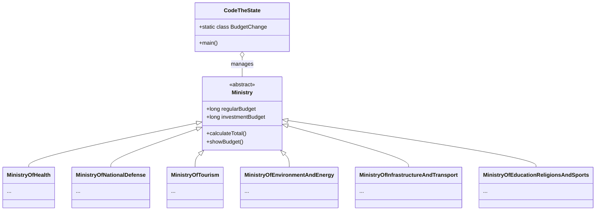

# 🏛️ CodeTheState

**CodeTheState** is a Java-based Command Line Interface (CLI) application that simulates the management of the national public budget. The user takes on the role of the Prime Minister/Administrator and is tasked with making economic decisions, managing ministry budgets, and maintaining the country's fiscal balance while adhering to European Union regulations.

This project was developed as part of the **Programming II** course.

---

## 📋 Table of Contents
1. [Technologies](#-technologies)
2. [Repository Structure](#-repository-structure)
3. [Build & Execution Instructions](#-build--execution-instructions)
4. [User Guide](#-user-guide)
5. [Architecture & UML](#-architecture--uml)
6. [Data Structures & Algorithms](#-data-structures--algorithms)
7. [Technical Documentation & Testing](#-technical-documentation--testing)
8. [Future Extensions](#-future-extensions)

---

## 🛠 Technologies

The project was developed using the following tools:

* **Language:** Java (JDK 17+)
* **Build Tool:** Apache Maven
* **Testing:** JUnit 5 (for Unit Testing)
* **Code Quality:** Checkstyle

---

## 📂 Repository Structure

The code is organized under the `com.bitcrew` package, ensuring a unified structure and maintainability.

```text
CodeTheState/
├── src/
│   ├── main/java/com/bitcrew/
│   │   ├── App.java                                # Entry point wrapper
│   │   ├── CodeTheState.java                       # Main Logic & Menu
│   │   ├── IncomeAndOutcome.java                   # Global economic data management
│   │   ├── Ministry.java                           # Abstract Base Class
│   │   ├── MinistryOfEducationReligionsAndSports.java
│   │   ├── MinistryOfEnvironmentAndEnergy.java
│   │   ├── MinistryOfHealth.java
│   │   ├── MinistryOfInfrastructureAndTransport.java
│   │   ├── MinistryOfNationalDefense.java
│   │   └── MinistryOfTourism.java
│   └── test/java/com/bitcrew/                      # Unit Tests (JUnit)
│       ├── IncomeAndOutcomeTest.java
│       ├── MinistryOfEducationReligionsAndSportsTest.java
│       ├── MinistryOfEnvironmentAndEnergyTest.java
│       ├── MinistryOfHealthTest.java
│       ├── MinistryOfInfrastructureAndTransportTest.java
│       ├── MinistryOfNationalDefenseTest.java
│       ├── MinistryOfTourismTest.java
│       └── MinistryTest.java
├── target/                                         # Compiled binaries (generated after build)
├── checkstyle.xml                                  # Code style configuration
├── pom.xml                                         # Maven configuration
├── README.md                                       # Documentation
└── TECHNICAL_REPORT_GR.md                          # Technical Report in Greece         
```

---

## 🚀 Build & Execution Instructions

### 1. Build
Open a terminal in the root directory of the project and run the Maven command:

```bash
mvn clean package
```
*This command will clean previous builds, run the tests, and generate the executable `.jar` file.*

### 2. Run
After a successful build, execute the generated `.jar` file located in the `target/` folder:

```bash
java -jar target/CodeTheState-1.0-SNAPSHOT.jar
```

---

## 📖 User Guide

The application operates via an interactive console menu. The basic workflow is as follows:

1.  **View Revenues & Expenses:** Displays the current summary of the state budget (Revenues, Expenses, Balance).
2.  **View Ministries:** Displays a list of current budgets per ministry.
3.  **Adjust Ministries' Budgets:**
    * Select a specific Ministry and Budget Type (**Regular** or **Investment**).
    * Increase or decrease amounts with validation checks (e.g., negative balances are prohibited).
    * **Dynamic VAT Adjustment:** In cases of significant deficit or surplus (>1 billion €), the system automatically suggests adjusting the VAT rate to balance the budget.
4.  **Compare with EU:** Compares Greece's budget balance with other EU member states (as a percentage of GDP).

---

## 📐 Architecture & UML

The architecture is based on **Object-Oriented Design (OOP)** principles, utilizing **Inheritance** and **Polymorphism**.

* **Ministry (Abstract):** Serves as a common template for all ministries.
* **Subclasses:** Each ministry (e.g., `MinistryOfHealth`) inherits from `Ministry` and implements specific budget categories.



---

## 📊 Data Structures & Algorithms

### Data Structures
* **ArrayList (`List<BudgetChange>`):** Used to store the history of budget changes. It allows for dynamic recording of user actions for the final summary report.
* **HashMap (`Map<String, Double>`):** Used in the EU comparison feature. It stores `Country Name` -> `Deficit/Surplus Percentage` pairs.
* **Inner Class (`static class BudgetChange`):** A helper class that groups data regarding a specific modification (Ministry, Amount Before, Amount After) for easier memory management.

### Algorithms
* **Sorting:** Uses a `Comparator` (via Lambda expression) to sort the list of EU countries. Sorting is descending (from highest surplus to highest deficit).
* **Input Validation (Loop):** Uses `while(true)` loops combined with `Scanner` to ensure the user enters valid data types, preventing application crashes.
* **VAT Calculation:** An algorithm that adjusts revenues based on the percentage change of the VAT rate and its contribution to total tax revenues.

---

## ⚙️ Technical Documentation & Testing

### Unit Testing
To ensure correct functionality, automated **Unit Tests** were implemented using the **JUnit 5** framework. The tests are located in `src/test/java` and cover:

* **IncomeAndOutcomeTest:** Verifies the correct calculation of general economic indicators.
* **Ministry Tests:** Separate tests for each ministry (e.g., `MinistryOfHealthTest`) verifying:
    * Correct summation of total budgets.
    * Proper handling of budget changes (ensuring no negative balances).

### Code Quality
The project uses **Checkstyle** (`checkstyle.xml`) to ensure code quality and adherence to naming conventions.

## 📄 Technical Report (Greek)

The full technical report (in Greek), prepared for the **Programming II** course, is available here:  
[Technical Report – Greek](TECHNICAL_REPORT_GR.md)
